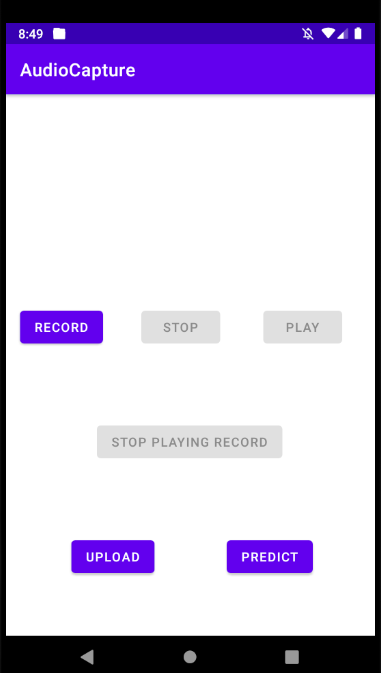

# Sound Respiratory Disease Detection App
data source: https://bhichallenge.med.auth.gr/

Respiratory sounds are important indicators of respiratory health and respiratory disorders. The sound emitted when a person breathes is directly related to air movement, changes within lung tissue and the position of secretions within the lung. A wheezing sound, for example, is a common sign that a patient has an obstructive airway disease like asthma or chronic obstructive pulmonary disease (COPD).

The goal of this project is to build a mobile app that can detect coughing and breathing sounds and analyze these sounds using algorithms developed by machine learning, then accurately produce a diagnosis or measure the severity of a patient’s respiratory condition. The project objectives also include achieving knowledge about machine learning and developing a mobile app in Java programming language by using the Android Studio tool.

In this app, we could detect 6 situation of the patients : bronchiectasis, pneumonia, bronchiolitis, COPD, URTI, and healthy.

## User Interface



First, pressing ```Record``` and start recording your coughing (recommend) or breathing sound for at least 10 seconds

Then ```Stop``` button is for finishing, we can play sound by ```Play``` to check the audio

Next we use ```Upload``` to send audio file recorded to our Flask server 

Finally, we get our result by  ```Predict``` button

